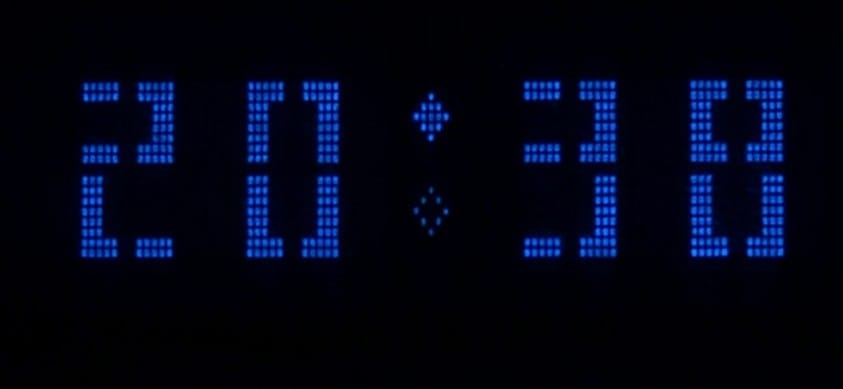

# clockMoveSepAnimazione

Big-font HH:MM clock on a **Futaba M202SD16 VFD** (20x2, HD44780 compatible) driven by an **Arduino Nano**, with DS3231 RTC for accurate timekeeping.

## Features

- **Big-font digits** — each digit spans 2 rows x 2 character cells using 8 custom CGRAM tiles
- **Animated colon separator** — 19-step animation cycle with filled/empty lozenge characters (ROM 0x96/0x97)
- **Horizontal pixel-wear shifting** — the clock periodically shifts position across the display to distribute phosphor wear
- **Auto-dimming** — brightness adjusts automatically based on sunrise/sunset times, calculated from GPS coordinates stored in EEPROM
- **EU DST support** — automatic CET/CEST switching (UTC stored in RTC, local time displayed)
- **Boot animation** — dot-matrix growth/split effect with brightness ramping; button triggers a triple sequence (normal + reverse + normal)
- **Breathing LED** — sine-wave PWM on D13
- **Piezo buzzer** — soft click on each minute change (Timer1 hardware tone)
- **CR2032 battery monitoring** — low-voltage warning with blinking indicator on display
- **Serial interface** — full control over time, brightness, GPS position, and more

## Font Preview

Generated with `_gen_preview.py`:

## Wiring

| Connection | Arduino Nano Pin |
|---|---|
| VFD RS (pin 4) | D12 |
| VFD R/W (pin 5) | D11 (OUTPUT LOW) |
| VFD E (pin 6) | D10 |
| VFD D4 (pin 11) | D5 |
| VFD D5 (pin 12) | D4 |
| VFD D6 (pin 13) | D3 |
| VFD D7 (pin 14) | D2 |
| VFD VSS (pin 1) | GND |
| VFD VDD (pin 2) | +5V |
| RTC SDA | A4 |
| RTC SCL | A5 |
| RTC VCC / GND | +5V / GND |
| Breathing LED | D13 (with resistor) |
| Buzzer signal | D9 (via 220 ohm) |
| Buzzer GND | D8 (software ground) |
| Button | D7 (INPUT_PULLUP) |
| Button GND | D6 (software ground) |
| CR2032 (+) | A3 (via 100k ohm) |

Full wiring details: [wiring.pdf](wiring.pdf)

## Serial Commands (9600 baud)

| Command | Description |
|---|---|
| `s:DDMMYYYY-HHmmSS` | Set local date and time |
| `M` / `m` | +/- 1 minute |
| `D` / `d` | +/- 10 minutes |
| `H` / `h` | +/- 1 hour |
| `0`-`4` | Brightness (0=off, 1=25%, 2=50%, 3=75%, 4=100%) |
| `9` | Auto-dimming (sunrise/sunset) |
| `p:lat,lon` | Set GPS position (e.g. `p:41.9028,12.4964`) |
| `v` | CR2032 battery voltage |
| `i` | Replay boot animation |
| `r` | Software reset |

## Hardware

- **Display:** Futaba M202SD16FA — 20x2 VFD, HD44780 compatible
- **MCU:** Arduino Nano (ATmega328P)
- **RTC:** DS3231 on ZS-042 module (I2C)
- **Battery:** CR2032 coin cell for RTC backup

### ZS-042 module modification

The ZS-042 module includes a charging circuit (resistor + diode) designed for rechargeable LIR2032 batteries. Since this project uses a non-rechargeable CR2032, the resistor in series with the diode leading to the battery must be removed to disable the charging circuit and prevent damage to the coin cell.

Additionally, a wire has been soldered to the positive terminal of the battery holder and connected to pin A3 (via a 100k ohm resistor) to allow the Arduino to monitor the CR2032 voltage.

## Third-Party Documentation

The file `futaba_m202s.pdf` is the original datasheet for the Futaba M202SD16FA display, included for reference only. All rights belong to Futaba Corporation. It is not covered by the project license and is redistributed here solely for the convenience of builders replicating this project.

## License

- **Code:** GPL-3.0-or-later
- **Font design** (TILES/DIGITS matrices): CC BY-SA 4.0

## Author

ghedo (luca.ghedini@gmail.com) — 2026

Built with [Claude Code](https://claude.ai/claude-code) by Anthropic.
