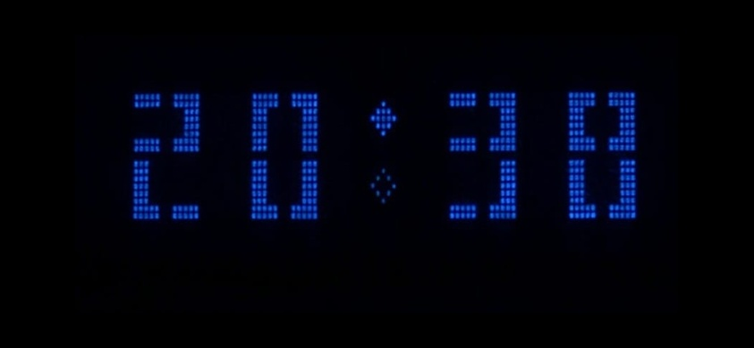
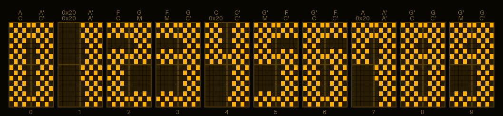

# clockMoveSepAnimazione

Big-font HH:MM clock on a **Futaba M202SD16 VFD** (20x2, HD44780 compatible) driven by an **Arduino Nano**, with DS3231 RTC for accurate timekeeping.

## Features

- **7+1+1 switchable big-font styles** — 3 edgy + 4 curvy variants, each digit spans 2 rows x 2 character cells using 8 custom CGRAM tiles. Button press cycles through the 7 parametric fonts; double-press activates the hidden alien font; triple-press activates checkerboard mode.
- **Animated colon separator** — 19-step animation cycle with filled/empty lozenge characters (ROM 0x96/0x97)
- **Horizontal pixel-wear shifting** — the clock periodically shifts position across the display to distribute phosphor wear
- **Auto-dimming** — brightness adjusts automatically based on sunrise/sunset times, calculated from GPS coordinates stored in EEPROM
- **EU DST support** — automatic CET/CEST switching (UTC stored in RTC, local time displayed)
- **Boot animation** — dot-matrix growth/split effect with brightness ramping
- **Breathing LED** — cosine-ramp PWM on D13
- **Piezo buzzer** — soft click on each minute change (Timer1 hardware tone)
- **CR2032 battery monitoring** — low-voltage warning with blinking indicator on display
- **Serial interface** — full control over time, brightness, GPS position, and more

## Fonts

Eight built-in font styles. The first seven are parametrically generated from stroke width (h = horizontal bar rows, v = vertical bar columns); the eighth is a hand-designed alien/runic font with diagonal strokes:

| Font | Style | Horizontal (h) | Vertical (v) |
|---|---|---|---|
| edgy_h2v3 | Sharp corners | 2 rows | 3 cols |
| edgy_h3v3 | Sharp corners | 3 rows | 3 cols |
| edgy_h2v2 | Sharp corners | 2 rows | 2 cols |
| curvy_h2v3 | Rounded corners | 2 rows | 3 cols |
| curvy_h3v3 | Rounded corners | 3 rows | 3 cols |
| curvy_h2v2 | Rounded corners | 2 rows | 2 cols |
| curvy_h3v2 | Rounded corners | 3 rows | 2 cols |
| alien | Diagonal rune glyphs | — | — |

### Checkerboard mode

Based on the edgy_h3v4 font. The original tiles are split into two complementary sub-fonts using a checkerboard pixel mask: phase A keeps pixels where (row+col) is even, phase B keeps the complement. The two phases alternate following the same timing sequence as the separator animation — a long pause (~2.4 s) then a burst of rapid flips (50–168 ms each), 15 cycles per minute.

Activated via triple-press or serial command `c`. Any single/double press exits back to the normal font carousel.

Phase A | Phase B (together they reconstruct the original):

Preview (edgy_h2v3, default):

## Wiring

| Connection | Arduino Nano Pin |
|---|---|
| VFD RS (pin 4) | D12 |
| VFD R/W (pin 5) | D11 (OUTPUT LOW) |
| VFD E (pin 6) | D10 |
| VFD D4 (pin 11) | D5 |
| VFD D5 (pin 12) | D4 |
| VFD D6 (pin 13) | D3 |
| VFD D7 (pin 14) | D2 |
| VFD VSS (pin 1) | GND |
| VFD VDD (pin 2) | +5V |
| RTC SDA | A4 |
| RTC SCL | A5 |
| RTC VCC / GND | +5V / GND |
| Breathing LED | D13 (with resistor) |
| Buzzer signal | D9 (via 220 ohm) |
| Buzzer GND | D8 (software ground) |
| Button | D7 (INPUT_PULLUP) |
| Button GND | D6 (software ground) |
| CR2032 (+) | A3 (via 100k ohm) |

Full wiring details: [wiring.pdf](wiring.pdf)

## Serial Commands (9600 baud)

| Command | Description |
|---|---|
| `s:DDMMYYYY-HHmmSS` | Set local date and time |
| `M` / `m` | +/- 1 minute *(updates RTC)* |
| `D` / `d` | +/- 10 minutes *(updates RTC)* |
| `H` / `h` | +/- 1 hour *(updates RTC)* |
| `0`-`4` | Brightness (0=off, 1=25%, 2=50%, 3=75%, 4=100%) |
| `9` | Auto-dimming (sunrise/sunset) |
| `p:lat,lon` | Set GPS position (e.g. `p:41.9028,12.4964`) |
| `v` | CR2032 battery voltage |
| `c` | Toggle checkerboard mode |
| `i` | Replay boot animation |
| `r` | Software reset |

## Hardware

- **Display:** Futaba M202SD16FA — 20x2 VFD, HD44780 compatible
- **MCU:** Arduino Nano (ATmega328P)
- **RTC:** DS3231 on ZS-042 module (I2C)
- **Battery:** CR2032 coin cell for RTC backup

### ZS-042 module modification

The ZS-042 module includes a charging circuit (resistor + diode) designed for rechargeable LIR2032 batteries. Since this project uses a non-rechargeable CR2032, the resistor in series with the diode leading to the battery must be removed to disable the charging circuit and prevent damage to the coin cell.

Additionally, a wire has been soldered to the positive terminal of the battery holder and connected to pin A3 (via a 100k ohm resistor) to allow the Arduino to monitor the CR2032 voltage.

## Third-Party Documentation

The following datasheets are included in this directory for reference only. All rights belong to their respective owners. They are not covered by the project license and are redistributed solely for the convenience of builders replicating this project.

- `futaba_m202s.pdf` — Futaba M202SD16FA display datasheet
- `DS3231SN.pdf` — DS3231 RTC module datasheet

## License

- **Code:** GPL-3.0-or-later
- **Font design** (TILES/DIGITS matrices): CC BY-SA 4.0

## Author

ghedo (luca.ghedini@gmail.com) — 2026

Built with [Claude Code](https://claude.ai/claude-code) by Anthropic.
